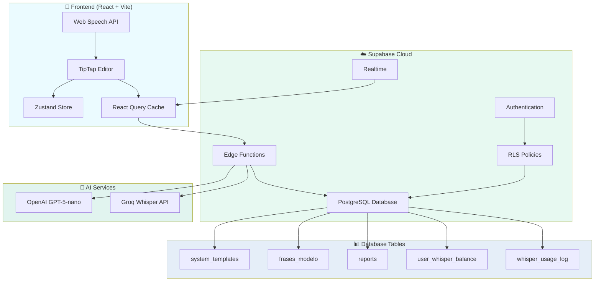

<div align="center">
  
  
  # RadReport
  
  ### Sistema Inteligente de Laudos Radiológicos com IA
  
  <p>
    <a href="#-funcionalidades">Funcionalidades</a> •
    <a href="#-tecnologias">Tecnologias</a> •
    <a href="#-instalação">Instalação</a> •
    <a href="#-arquitetura">Arquitetura</a> •
    <a href="#-planos">Planos</a>
  </p>

  
  
  
  
  
  

</div>

---

## 📋 Sobre o Projeto

**RadReport** é um sistema inteligente para elaboração de laudos radiológicos desenvolvido especificamente para radiologistas. Combina editores de texto avançados, inteligência artificial, ditado por voz premium e uma vasta biblioteca de templates e tabelas de referência para maximizar a produtividade e padronização dos laudos médicos.

### 🎯 Público-Alvo
- Radiologistas individuais
- Clínicas de diagnóstico por imagem
- Profissionais que realizam 50+ laudos/dia

### 🚀 Proposta de Valor
- **Redução de 60%** no tempo de elaboração de laudos
- **Padronização** conforme diretrizes internacionais (ACR, ASNR, FIGO, WHO)
- **Integração de IA** para conclusões, sugestões e classificações RADS
- **Ditado por voz** com transcrição Whisper de alta precisão
- **Conformidade LGPD** com dados processados localmente

---

## ✨ Funcionalidades

### 📝 Editor de Laudos
- **Editor TipTap** com toolbar completa (negrito, itálico, listas, tabelas, imagens)
- **Auto-save** a cada 30 segundos
- **Histórico de versões** com rollback
- **Exportação formatada** para Word/LibreOffice (Arial 12pt, espaçamento profissional)
- **Formatação automática** de medidas (padrão brasileiro: vírgula como separador decimal)

### 🎤 Ditado por Voz Premium
- **Web Speech API** para preview em tempo real (<200ms latência)
- **Whisper AI Premium** (Groq) para transcrição de alta precisão
- **Sistema de créditos** (1 crédito = 1 minuto de áudio)
- **Corretor AI** com GPT-5-nano para refinamento semântico
- **Comandos de voz** integrados (pontuação, parágrafos, formatação)
- **Capitalização inteligente** após pontuação
- **Proteção de privacidade** (microfone desliga em troca de aba)

### 🤖 Inteligência Artificial
- **IA Conclusão** - Geração automática de impressão diagnóstica baseada nos achados
- **IA Sugestões** - Revisão e melhoria de laudos com sugestões contextualizadas
- **Classificação RADS** - Detecção e classificação automática (BI-RADS, TI-RADS, PI-RADS, LI-RADS, etc.)
- **Corretor AI** - Refinamento de texto ditado (pontuação, parágrafos, terminologia médica)

### 📚 Biblioteca de Conteúdo
- **150+ Templates Dinâmicos** com variáveis preenchíveis (TC, RM, US, RX, MG)
- **245+ Frases Modelo** organizadas por modalidade e sistema anatômico
- **100+ Tabelas de Referência** (RADS, TNM, WHO, classificações internacionais)
  - Neuroradiologia (18 tabelas: ASPECTS, Fisher, Fazekas, Hunt-Hess, etc.)
  - Cabeça e Pescoço (16 tabelas: NI-RADS, Lund-Mackay, TNM, STAMCO, etc.)
  - Tórax (20 tabelas: Lung-RADS, Fleischner, Berlin ARDS, TNM Pulmão, etc.)
  - Abdome (22 tabelas: LI-RADS, PI-RADS, O-RADS, Child-Pugh, Bosniak, etc.)
  - Musculoesquelético (24 tabelas: Cobb, Graf DDQ, Outerbridge, AAST Trauma, etc.)
  - Vascular (18 tabelas: Wells, Geneva, PESI, classificações vasculares)
  - Obstetrícia (18 tabelas: peso fetal, ILA, Doppler, biometria)

### 🔍 Correção Ortográfica Médica
- **4.300+ termos médicos** no dicionário radiológico
- **Correção fonética** automática para erros de ditado
- **Normalização morfológica** (acentuação, espaçamento)
- **Stopwords portuguesas** (~150 termos estruturais)
- **Sugestões baseadas em Levenshtein** para termos desconhecidos

### 🔐 Autenticação e Segurança
- **Google OAuth** para login rápido
- **Email/senha** com validação forte
- **Reset de senha** via email
- **Verificação de email** obrigatória
- **Cloudflare Turnstile** anti-bot
- **RLS Policies** no Supabase para isolamento de dados por usuário
- **Conformidade LGPD**

---

## 🛠️ Tecnologias

### Frontend
| Tecnologia | Versão | Uso |
|------------|--------|-----|
| **React** | 18.3 | Framework UI |
| **TypeScript** | 5.8 | Tipagem estática |
| **Vite** | 6.0 | Build tool |
| **TailwindCSS** | 3.4 | Estilização |
| **TipTap** | 3.11 | Editor de texto WYSIWYG |
| **Zustand** | 5.0 | Estado global |
| **React Query** | 5.83 | Gerenciamento de cache |
| **React Hook Form** | 7.61 | Formulários |
| **Zod** | 3.25 | Validação de schemas |
| **Framer Motion** | - | Animações |

### Backend
| Tecnologia | Uso |
|------------|-----|
| **Supabase** | Backend-as-a-Service |
| **PostgreSQL** | Banco de dados relacional |
| **Edge Functions** | Serverless functions (Deno) |
| **Row Level Security** | Isolamento de dados por usuário |
| **Realtime** | Sincronização em tempo real |

### IA e ML
| Serviço | Modelo | Uso |
|---------|--------|-----|
| **OpenAI** | GPT-5-nano | IA Conclusão, Sugestões, Corretor AI, RADS |
| **Groq** | Whisper-large-v3-turbo | Transcrição de áudio premium |
| **Web Speech API** | Nativo do navegador | Preview em tempo real do ditado |

---

## 🏗️ Arquitetura



### 🔗 Fluxo de Dados

1. **Usuário** digita ou dita no editor TipTap
2. **Web Speech API** fornece preview em tempo real (opcional)
3. **MediaRecorder** captura áudio e envia para **Edge Function** `transcribe-audio`
4. **Groq Whisper** transcreve áudio com alta precisão
5. **Corretor AI** refina texto (se habilitado) via `ai-dictation-polish`
6. **Texto processado** é inserido no editor
7. **Auto-save** persiste conteúdo no Supabase a cada 30s
8. **IA Conclusão** gera impressão diagnóstica via `ai-generate-conclusion`
9. **Classificação RADS** detecta e classifica via `ai-rads-classification`
10. **Exportação** formata para Word com padrões profissionais

---

## 📦 Edge Functions

O RadReport utiliza **8 Edge Functions** no Supabase para processamento backend:

| Função | Descrição | Modelo AI |
|--------|-----------|-----------|
| `transcribe-audio` | Transcrição de áudio via Groq Whisper | Whisper-large-v3-turbo |
| `ai-generate-conclusion` | Geração de conclusões diagnósticas | GPT-5-nano |
| `ai-rads-classification` | Classificação automática RADS | GPT-5-nano |
| `ai-suggestion-review` | Sugestões de melhoria de laudos | GPT-5-nano |
| `ai-dictation-polish` | Corretor AI para texto ditado | GPT-5-nano |
| `ai-inline-edit` | Edição inline de texto | GPT-5-nano |
| `ai-voice-inline-edit` | Edição por comandos de voz | GPT-5-nano |
| `radreport-chat` | Chat interativo com IA radiológica | GPT-5-nano |

**Configuração**: Todas as funções utilizam `verify_jwt = false` para acesso público via cliente autenticado.

---

## 🚀 Instalação

### Pré-requisitos
- Node.js 18+ e npm
- Conta Supabase (gratuita)
- API Keys (OpenAI, Groq, Turnstile)

### 1️⃣ Clone o Repositório
```bash
git clone https://github.com/radai-labs/radreport.git
cd radreport
```

### 2️⃣ Instale as Dependências
```bash
npm install
```

### 3️⃣ Configure Variáveis de Ambiente
Crie um arquivo `.env` na raiz do projeto:

```env
# Supabase
VITE_SUPABASE_URL=https://seu-projeto.supabase.co
VITE_SUPABASE_PUBLISHABLE_KEY=sua-chave-publica

# OpenAI (para Edge Functions)
OPENAI_API_KEY=sk-...

# Groq (para Whisper)
GROQ_API_KEY=gsk_...

# Cloudflare Turnstile
TURNSTILE_SITE_KEY=0x...
TURNSTILE_SECRET_KEY=0x...
```

### 4️⃣ Execute o Projeto
```bash
npm run dev
```

Acesse: `http://localhost:5173`

### 5️⃣ Deploy das Edge Functions (Opcional)
```bash
npx supabase functions deploy transcribe-audio
npx supabase functions deploy ai-generate-conclusion
npx supabase functions deploy ai-rads-classification
npx supabase functions deploy ai-suggestion-review
npx supabase functions deploy ai-dictation-polish
npx supabase functions deploy ai-inline-edit
npx supabase functions deploy ai-voice-inline-edit
npx supabase functions deploy radreport-chat
```

---

## 📁 Estrutura de Pastas

```
radreport/
│
├── public/                      # Assets estáticos
│   ├── favicon.ico
│   └── robots.txt
│
├── src/
│   ├── components/              # Componentes React
│   │   ├── editor/              # Componentes do editor
│   │   │   ├── EditorHeader.tsx
│   │   │   ├── EditorFooter.tsx
│   │   │   ├── EditorLeftSidebar.tsx
│   │   │   ├── EditorRightSidebar.tsx
│   │   │   ├── EditorAIButton.tsx
│   │   │   ├── CalculatorsDropdown.tsx
│   │   │   ├── TablesDropdown.tsx
│   │   │   ├── TableViewerModal.tsx
│   │   │   └── TemplateVariablesModal.tsx
│   │   │
│   │   ├── selectors/           # Seletores de templates/frases
│   │   │   ├── TemplateSelector.tsx
│   │   │   └── MacroSelector.tsx
│   │   │
│   │   ├── tiptap-icons/        # 37 ícones oficiais TipTap
│   │   ├── tiptap-ui/           # Componentes UI do TipTap
│   │   ├── tiptap-ui-primitive/ # Primitivos (button, toolbar, spacer)
│   │   ├── tiptap-node/         # Estilos de nodes (blockquote, code, etc.)
│   │   ├── tiptap-templates/    # Template SimpleEditor oficial
│   │   │
│   │   ├── ui/                  # shadcn/ui components
│   │   │   ├── button.tsx
│   │   │   ├── dialog.tsx
│   │   │   ├── dropdown-menu.tsx
│   │   │   └── ... (40+ componentes)
│   │   │
│   │   ├── voice/               # Componentes de voz
│   │   │   ├── VoiceButton.tsx
│   │   │   └── SpeechStatusPanel.tsx
│   │   │
│   │   ├── chat/                # Sistema de chat com IA
│   │   ├── hero/                # Landing page
│   │   └── layout/              # Layouts
│   │
│   ├── extensions/              # Extensões TipTap customizadas
│   │   ├── RadiologySpellChecker.ts
│   │   ├── FontSizeExtension.ts
│   │   ├── InformativeTableExtension.ts
│   │   ├── radiology-dict.ts
│   │   ├── phonetic-rules.ts
│   │   ├── morphology-rules.ts
│   │   └── portuguese-stopwords.ts
│   │
│   ├── hooks/                   # React hooks customizados
│   │   ├── useAuth.ts
│   │   ├── useDictation.ts
│   │   ├── useTemplates.ts
│   │   ├── useFrasesModelo.ts
│   │   ├── useWhisperCredits.ts
│   │   ├── useChat.ts
│   │   └── useSupabaseReports.ts
│   │
│   ├── lib/                     # Utilitários e configurações
│   │   ├── radiologyCalculators.ts
│   │   ├── radiologyTables.ts
│   │   ├── voiceCommandsConfig.ts
│   │   └── utils.ts
│   │
│   ├── pages/                   # Páginas da aplicação
│   │   ├── Index.tsx            # Landing page
│   │   ├── Login.tsx
│   │   ├── SignUp.tsx
│   │   ├── Editor.tsx
│   │   ├── Precos.tsx
│   │   └── ...
│   │
│   ├── services/                # Serviços de dados
│   │   ├── SupabaseService.ts
│   │   └── DataService.ts
│   │
│   ├── store/                   # Estado global (Zustand)
│   │   └── index.ts
│   │
│   ├── utils/                   # Funções utilitárias
│   │   ├── medicalTextProcessor.ts
│   │   ├── templateFormatter.ts
│   │   ├── templateVariableProcessor.ts
│   │   ├── textFormatter.ts
│   │   └── validation.ts
│   │
│   ├── integrations/            # Integrações externas
│   │   └── supabase/
│   │       ├── client.ts
│   │       └── types.ts         # Tipos gerados automaticamente
│   │
│   ├── index.css                # Estilos globais + design system
│   ├── main.tsx                 # Entry point
│   └── App.tsx
│
├── supabase/
│   ├── functions/               # 8 Edge Functions (Deno)
│   │   ├── transcribe-audio/
│   │   ├── ai-generate-conclusion/
│   │   ├── ai-rads-classification/
│   │   ├── ai-suggestion-review/
│   │   ├── ai-dictation-polish/
│   │   ├── ai-inline-edit/
│   │   ├── ai-voice-inline-edit/
│   │   └── radreport-chat/
│   │
│   ├── migrations/              # Migrações do banco
│   └── config.toml              # Configuração Supabase
│
├── .env                         # Variáveis de ambiente
├── package.json
├── tsconfig.json
├── tailwind.config.ts
├── vite.config.ts
└── README.md
```

---

## 💰 Planos e Preços

| Plano | Tokens/mês | Créditos Whisper | Preço | Ideal para |
|-------|------------|------------------|-------|------------|
| **Gratuito** | 20 | 0 | R$ 0 | Teste (~10 laudos) |
| **Básico** | 1.500 | 0 | R$ 79/mês | ~750 laudos/mês |
| **Profissional** ⭐ | 4.000 | 50 | R$ 149/mês | ~2.000 laudos/mês |
| **Premium** | 8.000 | 200 | R$ 249/mês | ~4.000 laudos/mês |

### 📊 Consumo de Tokens
- **Conclusão AI**: 2 tokens
- **Sugestões AI**: 2 tokens
- **Classificação RADS**: 2 tokens
- **Chat com IA**: 1 token por mensagem

### 🎤 Créditos Whisper
- **1 crédito** = 1 minuto de áudio (arredondado para cima)
- Máximo de **5 créditos por transcrição** (5 minutos)
- Fallback automático para Web Speech se créditos esgotados

---

## 📊 Banco de Dados

### Principais Tabelas

| Tabela | Descrição | Registros |
|--------|-----------|-----------|
| `system_templates` | Templates dinâmicos com variáveis | ~150 |
| `frases_modelo` | Frases modelo pré-definidas | ~245 |
| `reports` | Laudos dos usuários | N/A |
| `user_whisper_balance` | Saldo de créditos Whisper | 1 por usuário |
| `whisper_usage_log` | Log de uso do Whisper | Histórico |
| `whisper_credits_ledger` | Ledger imutável de transações | Auditoria |
| `user_favorite_templates` | Templates favoritos | N/A |
| `user_favorite_frases` | Frases favoritas | N/A |
| `user_template_usage` | Histórico de uso de templates | N/A |
| `user_frase_usage` | Histórico de uso de frases | N/A |
| `ai_conclusion_logs` | Logs de conclusões geradas | Auditoria |
| `ai_rads_logs` | Logs de classificações RADS | Auditoria |
| `ai_review_log` | Logs de sugestões | Auditoria |
| `ai_voice_logs` | Logs de comandos de voz | Auditoria |

### 🔒 Segurança
- **Row Level Security (RLS)** em todas as tabelas
- Policies isolam dados por `user_id`
- Auditoria completa via logs imutáveis

---

## 🤝 Contribuição

Este é um projeto proprietário da **RadAi Labs**. Contribuições externas não são aceitas no momento.

Para reportar bugs ou sugerir funcionalidades, entre em contato via:
- **Email**: suporte@radreport.com.br
- **Discord**: [RadAi Labs Community](https://discord.gg/radailabs)

---

## 📄 Licença

**Proprietary License**

© 2025 RadReport – Uma plataforma RadAi Labs  
**RadAi Labs LTDA** · CNPJ: 63.762.346/0001-47

Todos os direitos reservados. Este software é proprietário e não pode ser copiado, modificado, distribuído ou usado sem permissão expressa por escrito da RadAi Labs LTDA.

---

## 📞 Contato

### RadAi Labs
- 🌐 Website: [https://radreport.com.br](https://radreport.com.br)
- 📧 Email: contato@radailabs.com.br
- 💬 Suporte: suporte@radreport.com.br
- 🐦 Twitter: [@radailabs](https://twitter.com/radailabs)
- 💼 LinkedIn: [RadAi Labs](https://linkedin.com/company/radailabs)

### Equipe de Desenvolvimento
- **Arquitetura e Backend**: [Seu Nome]
- **Frontend e Design**: [Seu Nome]
- **IA e Machine Learning**: [Seu Nome]

---

<div align="center">
  
  **Feito com ❤️ pela equipe RadAi Labs**
  
  <p>Transformando a radiologia com inteligência artificial</p>
  
  ⭐ **Star este repositório se você achou útil!**
  
</div>
